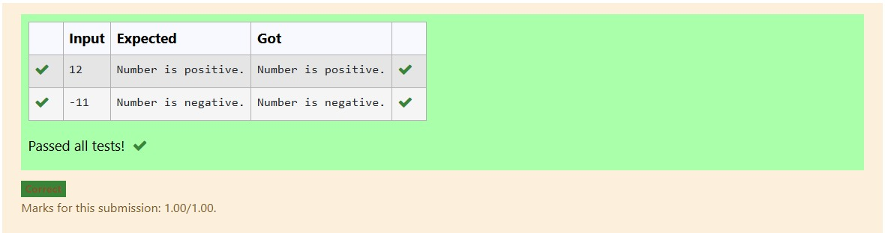
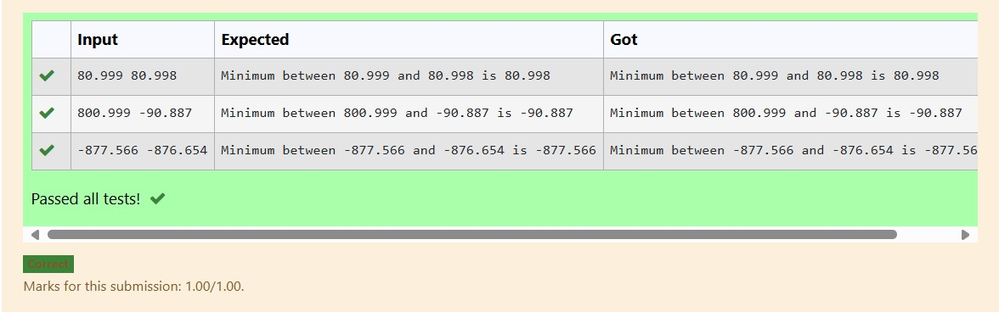
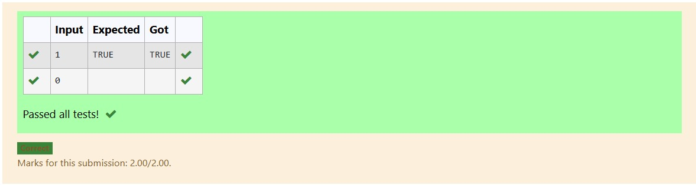
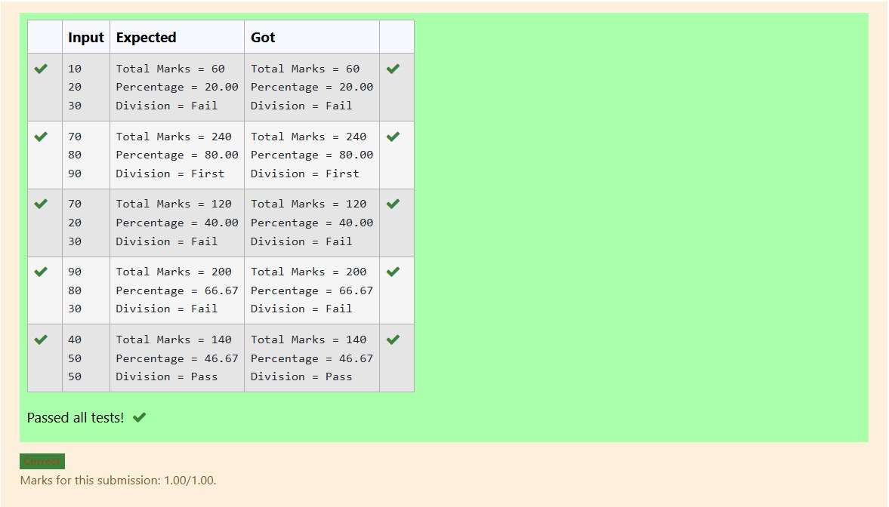

# EX-01-Datatypes-Operators
## AIM:
Write a C program to read 3 characters one by one and print the characters in a reverse order.

## ALGORITHM:
1.	Declare three character variables to store the input characters.
2.	Use the scanf function to read the characters one by one from the user.
3.	Print the characters in reverse order using the printf function.
4.	End the program.

## PROGRAM:
```
#include<stdio.h>
int main() {
    char char1, char2, char3;

    
    printf("Enter the first character: ");
    scanf(" %c", &char1); 

    
    printf("Enter the second character: ");
    scanf(" %c", &char2);

    
    printf("Enter the third character: ");
    scanf(" %c", &char3);

    
    printf("Characters in reverse order: %c %c %c\n", char3, char2, char1);

    return 0;
}
```
## OUTPUT:




## RESULT:
Thus the program to read 3 characters one by one and print the characters in a reverse order has been executed successfully.


# EX-02- Conditional-Statements
## AIM:
Write a C program to read A values and check whether A is positive number or not.

# ALGORITHM:
1.	Declare a variable to store the input value A.
2.	Use the scanf function to read the value of A from the user.
3.	Check if the value of A is greater than zero.
4.	If A is greater than zero, print a message indicating that it's a positive number. 
5.	Otherwise, print a message indicating that it's not a positive number.
6.End the program.

# PROGRAM:
```
#include <stdio.h>
int main() {
    int A; 

   
    printf("Enter an integer value for A: ");

 
    scanf("%d", &A);

  
    if (A > 0) {
        printf("%d is a positive number.\n", A);
    } else if (A == 0) {
        printf("%d is zero, which is neither positive nor negative.\n", A);
    } else {
        printf("%d is not a positive number (it's negative).\n", A);
    }

    return 0; 
}
```

# OUTPUT:


# RESULT:
Thus the program to read A values and check whether A is positive number or not has been executed successfully.
 
 
 


# EX-03- Operators-Expressions
## AIM:
Write a program to find minimum between two fraction numbers using conditional operator or ternary operator.

## ALGORITHM:
1.	Declare variables to store the two fraction numbers and the result.
2.	Use the printf function to prompt the user to enter the first fraction number (numerator and denominator separately).
3.	Use the scanf function to read the numerator and denominator of the first fraction.
4.	Repeat steps 2 and 3 to get the second fraction from the user.
5.	Calculate the decimal values of both fractions by dividing the numerators by the denominators.
6.	Use the conditional (ternary) operator to compare the decimal values and store the minimum value in the result variable.
7.	Print the minimum value.

## PROGRAM:
```
#include<stdio.h>
int main() {
    float num1, num2, min_num;

    
    printf("Enter the first fractional number: ");
    scanf("%f", &num1);

    
    printf("Enter the second fractional number: ");
    scanf("%f", &num2);

    
    min_num = (num1 < num2) ? num1 : num2;

    
    printf("The minimum of %.2f and %.2f is %.2f\n", num1, num2, min_num);

    return 0; 
}
```

## OUTPUT:





## RESULT:
Thus the program to find minimum between two fraction numbers using conditional operator or ternary operator has been executed successfully.


# EX-04- Using Conditional Statements

## AIM:
Write a C program to check whether the input value is equal to 1 using simple if statement

## ALGORITHM:
1.	Declare a variable to store the input value.
2.	Use the scanf function to read the input value from the user.
3.	Use an if statement to check if the input value is equal to 1.
4.	If the condition in the if statement is true, print a message indicating that the input value is equal to 1.
5.	Otherwise, print a message indicating that it's not equal to 1.
6.	End the program.

## PROGRAM:
```
#include <stdio.h>

int main() {
    int inputValue;

   
    printf("Enter an integer value: ");

    
    scanf("%d", &inputValue);

    
    if (inputValue == 1) {
        printf("The input value is equal to 1.\n");
    } else {
        printf("The input value is not equal to 1.\n");
    }

    return 0; 
}
```

## OUTPUT:





    

## RESULT:
Thus the program to check whether the input value is equal to 1 using simple if statement has been executed successfully


# EX-05- Calculating Total, Percentage, And Division Using Conditional Statements 
## AIM:
To write a C program that reads marks of three subjects, calculates the total and percentage, and then determines the division (First, Second, Pass, or Fail) based on the percentage and minimum marks criteria.
## ALGORITHM:
1.	Start
2.	Declare integer variables m1, m2, m3 for marks, and float variables tot, per.
3.	Input the marks for three subjects.
4.	Calculate total marks: tot = m1 + m2 + m3
5.	Calculate percentage: per = tot / 3
6.	Display total and percentage.
7.	Check if all marks are greater than or equal to 40:
8.	If yes:
a.	If percentage >= 60: Print “Division = First”
b.	Else if percentage >= 48: Print “Division = Second”
c.	Else if percentage >= 36: Print “Division = Pass”
9.	Else: Print “Division = Fail”
10.	End
## PROGRAM:
```
#include <stdio.h>

int main() {
    int subject1_marks, subject2_marks, subject3_marks;
    int total_marks;
    float percentage;

    // Prompt user to enter marks for three subjects
    printf("Enter marks for Subject 1: ");
    scanf("%d", &subject1_marks);

    printf("Enter marks for Subject 2: ");
    scanf("%d", &subject2_marks);

    printf("Enter marks for Subject 3: ");
    scanf("%d", &subject3_marks);

    // Calculate total marks
    total_marks = subject1_marks + subject2_marks + subject3_marks;

    // Calculate percentage (assuming maximum marks for each subject is 100)
    percentage = (float)total_marks / 3.0;

    // Display total marks and percentage
    printf("\nTotal Marks: %d\n", total_marks);
    printf("Percentage: %.2f%%\n", percentage);

    // Determine and display the division
    if (percentage >= 60 && subject1_marks >= 35 && subject2_marks >= 35 && subject3_marks >= 35) {
        printf("Division: First Division\n");
    } else if (percentage >= 50 && subject1_marks >= 35 && subject2_marks >= 35 && subject3_marks >= 35) {
        printf("Division: Second Division\n");
    } else if (percentage >= 40 && subject1_marks >= 35 && subject2_marks >= 35 && subject3_marks >= 35) {
        printf("Division: Pass\n");
    } else {
        printf("Division: Fail\n");
    }

    return 0;
}
```
## OUTPUT:


## RESULT:
The program successfully takes three subject marks, calculates the total and percentage, and correctly determines the division based on predefined grading logic.

